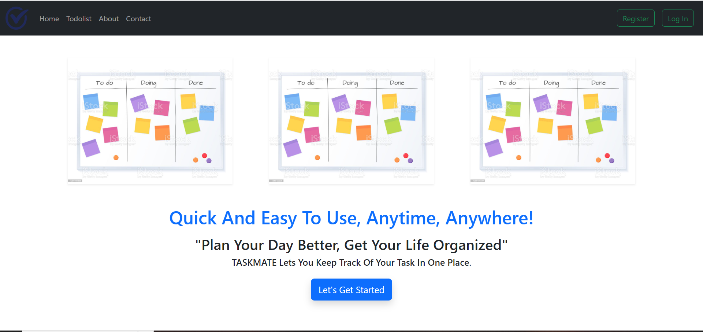
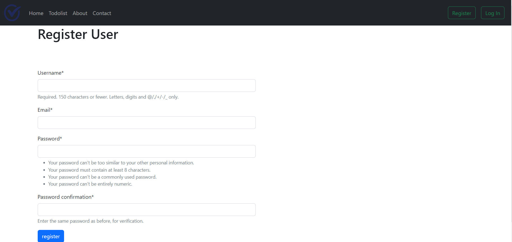
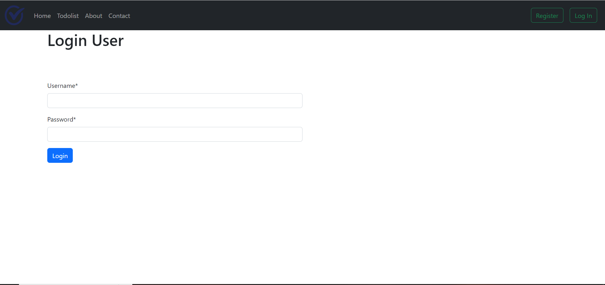
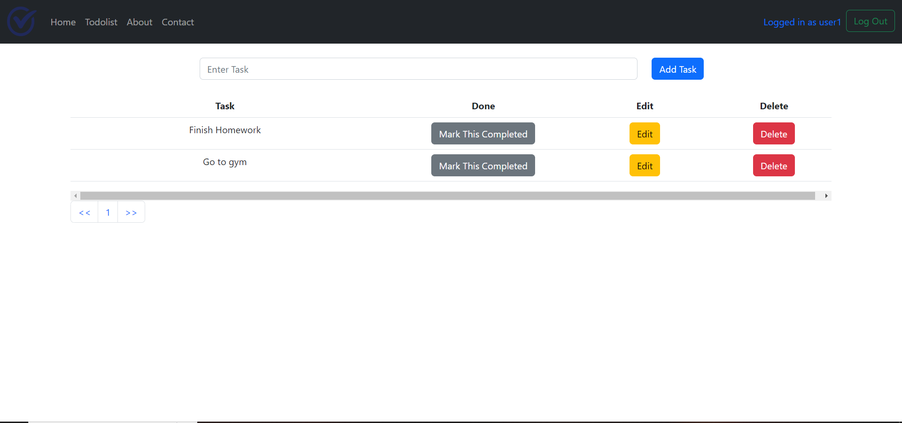

# Taskmate
Taskmate is a task manager web application built using the Django Framework. The aim of this project was to understand the working of Django Framework along with it's common features like MVT architecture, working with forms, default authentication, .env files and the deployment process on Railway platform along with PostgreSQL database.

## Screenshots

## Demo

If you want to see the app, check the link below.
Deployed on Railway - https://web-production-ad54.up.railway.app/
